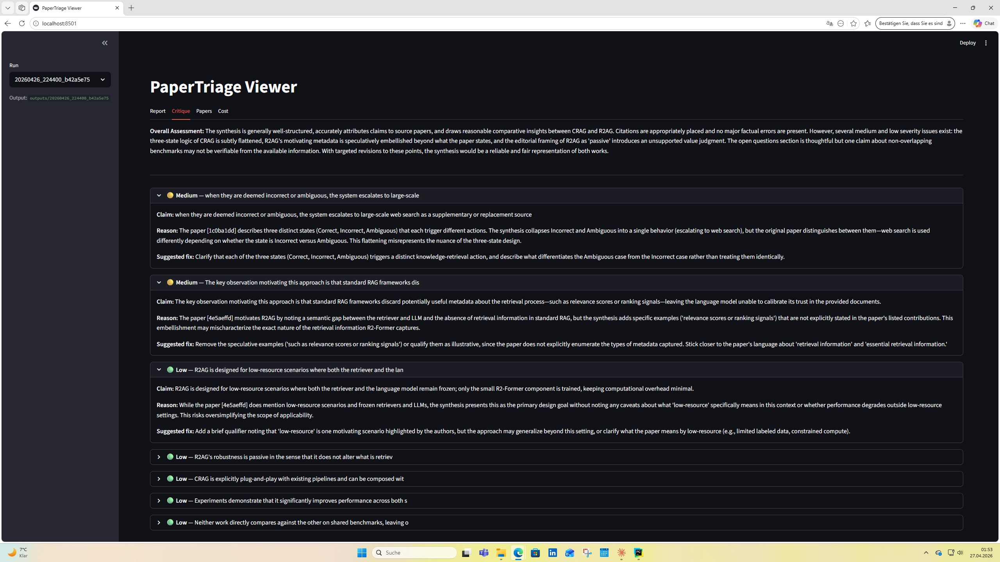

# papertriage


> Triage a folder of academic PDFs into a structured literature review using Claude.

## What this is

papertriage is a command-line tool that reads a directory of academic PDFs and produces a
structured literature review: clustered papers, a synthesised narrative, and an LLM-as-judge
critique pass. It is a **triage tool** — its job is to surface relevant papers and connections
quickly, not to replace careful reading.



*The critique pass surfaces unsupported claims and editorial overstatements with severity-coded findings and concrete suggested fixes. See [`examples/`](examples/) for the full run.*

## Why it exists

This project was built to demonstrate AI orchestration patterns in a realistic, end-to-end
setting:

- **Structured outputs** via Anthropic tool use (extraction, critique scoring)
- **Model routing** — Haiku for high-frequency per-paper parsing, Sonnet for synthesis and judging
- **Prompt caching** on the papers block to cut costs on repeated synthesis calls
- **LLM-as-judge** critique pass as a production safety pattern for catching hallucination
- **Observability** — structured JSON logs, per-stage cost tracking, versioned run artifacts
- **Evals** — field-level extraction scored against a small hand-labelled smoke-test set

## Architecture

```
               PDF files
                   │
     ┌─────────────▼──────────────────────────┐
     │  Stage 1 · Ingest                       │  pypdf → RawPaper[]
     │  Stage 2 · Extract                      │  ──▶ ClaudeClient (Haiku)
     │  Stage 3 · Cluster                      │  TF-IDF + agglomerative → Cluster[]
     │  Stage 4 · Synthesize                   │  ──▶ ClaudeClient (Sonnet)
     │  Stage 5 · Critique                     │  ──▶ ClaudeClient (Sonnet)
     └─────────────┬──────────────────────────┘
                   │
     ┌─────────────▼──────────────────────────┐
     │  outputs/<run_id>/                      │
     │    papers.json      clusters.json       │
     │    report.md        critique.md         │
     │    critique.json    cost.json           │
     │    run.log                              │
     └────────────────────────────────────────┘
```

All LLM calls route through `ClaudeClient` (`src/papertriage/llm/client.py`), which handles
retries, per-run budget enforcement, prompt caching, and cost estimation. Specific model
versions are configured via `.env` (`MODEL_EXTRACTION`, `MODEL_SYNTHESIS`) — not hardcoded.

## Quickstart

```bash
git clone <repo>
cd papertriage
python3 -m venv .venv && source .venv/bin/activate
pip install -e ".[dev]"
cp .env.example .env   # add your ANTHROPIC_API_KEY

mkdir -p papers        # drop a few PDFs into ./papers/
papertriage run --papers ./papers --question "What are recent approaches to X?"
make run-viewer
```

## How it works

| Stage | Model tier | Rationale |
|---|---|---|
| 1 · Ingest | — | pypdf text extraction; no LLM call |
| 2 · Extract | Haiku | One call per paper; cost-sensitive; structured output via tool use |
| 3 · Cluster | — | TF-IDF on method + problem text; agglomerative; no LLM call |
| 4 · Synthesize | Sonnet | Single call; needs reasoning depth; papers block is prompt-cached |
| 5 · Critique | Sonnet | LLM-as-judge; same tier as synthesis to catch its own failure modes |

The pipeline is orchestrated in `src/papertriage/orchestration/pipeline.py`. Failed extractions
are retained in `papers.json` for transparency but filtered out before clustering and synthesis.
Each run produces a timestamped directory under `outputs/`.

## Cost & budgeting

A hard per-run budget cap (default **$0.20**, configurable via `RUN_BUDGET_USD` in `.env`) is
enforced by `ClaudeClient`. The run raises `BudgetExceededError` if the cap is exceeded
mid-run; partial artifacts are always written before the exception propagates.

Prompt caching is applied to the papers block in Stages 4 and 5. If you re-synthesise the
same paper set with a different question, cache reads cost roughly 10% of a cold prompt.
Pricing figures in `src/papertriage/llm/cost.py` are approximations — check
[Anthropic pricing](https://anthropic.com/pricing) for current rates.

## Evals

The eval harness (`evals/run_eval.py`) measures **field-level extraction accuracy** against
hand-labelled entries in `evals/dataset/golden.json`:

| Field | Metric |
|---|---|
| `title`, `method` | Case-insensitive substring match (boolean) |
| `year` | Exact match (boolean) |
| `datasets`, `contributions` | Jaccard similarity on lowercased token sets (0.0–1.0) |

```bash
python -m evals.run_eval           # real API calls
python -m evals.run_eval --fake    # offline — returns golden fields as the extraction result
```

The `--fake` flag substitutes a client that echoes the golden expected fields directly, so
you can iterate on scoring logic and add test cases without spending API budget.

**Disclaimer:** the current eval set is intended for ~5 papers — smoke-test scale only. A
production benchmark would need 50+ diverse papers to yield meaningful numbers.

## Roadmap

**V1 — Polish & coverage**
- arXiv adapter: fetch PDFs by search query or paper ID
- Extraction caching: skip re-extraction of unchanged PDFs across runs

**V2 — Better signals**
- Embedding-based clustering with comparative evals against the TF-IDF baseline
- Multi-agent critique: multiple independent judge passes, results aggregated

**V3 — Interactive**
- Interactive review UI: approve/reject papers, annotate clusters inline
- Knowledge graph view: paper–paper citation and similarity edges

## Design decisions

1. **Filesystem outputs, not a database.** Each run is a self-contained directory of JSON and
   Markdown files. No migration ceremony, trivial to inspect, easy to archive or diff. A
   database makes sense at scale; not at this stage.

2. **TF-IDF clustering, not embeddings.** Honest baseline — fast, interpretable, and zero
   additional API cost. V2 will introduce embedding-based clustering and measure whether it
   actually improves the synthesis, rather than assuming it does.

3. **Model routing (Haiku / Sonnet split).** Extraction is called once per paper and needs
   precision but not deep reasoning — Haiku handles it at a fraction of Sonnet's cost.
   Synthesis and critique need genuine reasoning; Sonnet earns its cost there.

4. **LLM-as-judge critique pass.** A standard production pattern for hallucination mitigation.
   The same model tier that wrote the synthesis reviews it, surfacing overconfident claims and
   unsupported generalisations before the output reaches the reader.

## Limitations

- PDF parsing quality varies significantly by layout — two-column papers, equations, and
  tables are often mangled by pypdf.
- Synthesis hallucination is **mitigated but not eliminated** by the critique pass; always
  verify claims against the original papers for consequential decisions.
- The eval set is intentionally small (smoke-test scale); do not treat scores as a reliable
  accuracy estimate.
- No arXiv auto-fetching yet (planned for V1).
- Single-user CLI tool — not designed as a concurrent system or SaaS.

## License

MIT — see [LICENSE](LICENSE) file.
