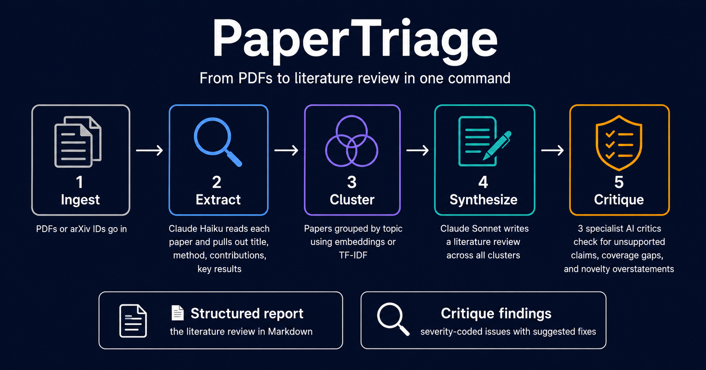

# papertriage


> Triage a folder of academic PDFs into a structured literature review using Claude.



## What this is

papertriage is a command-line tool that reads a directory of academic PDFs and produces a
structured literature review: clustered papers, a synthesised narrative, and an LLM-as-judge
critique pass. It is a **triage tool** — its job is to surface relevant papers and connections
quickly, not to replace careful reading.


*The critique pass surfaces unsupported claims and editorial overstatements with severity-coded findings and concrete suggested fixes. See [`examples/`](examples/README.md) for the full run.*

## Why it exists

This project was built to demonstrate AI orchestration patterns in a realistic, end-to-end
setting:

- **Structured outputs** via Anthropic tool use (extraction, critique scoring)
- **Model routing** — Haiku for high-frequency per-paper parsing, Sonnet for synthesis and judging
- **Prompt caching** on the papers block to cut costs on repeated synthesis calls
- **Multi-agent critique** — three specialized critic agents (factuality, coverage, novelty) with deduplication
- **Embedding-based clustering** — sentence-transformer embeddings as an alternative to TF-IDF, with head-to-head comparative evals
- **Observability** — structured JSON logs, per-stage cost tracking, versioned run artifacts
- **Evals** — field-level extraction scoring plus comparative evals for clustering and critique

## Architecture

```
               PDF files
                   │
     ┌─────────────▼──────────────────────────┐
     │  Stage 1 · Ingest                       │  pypdf → RawPaper[]
     │  Stage 2 · Extract                      │  ──▶ ClaudeClient (Haiku)
     │  Stage 3 · Cluster                      │  TF-IDF or Embedding → Cluster[]
     │  Stage 4 · Synthesize                   │  ──▶ ClaudeClient (Sonnet)
     │  Stage 5 · Critique                     │  ──▶ 3× ClaudeClient (Sonnet) [multi]
     └─────────────┬──────────────────────────┘
                   │
     ┌─────────────▼──────────────────────────┐
     │  outputs/<run_id>/                      │
     │    papers.json      clusters.json       │
     │    report.md        critique.md         │
     │    critique.json    cost.json           │
     │    meta.json        run.log             │
     │    review.json      (written by viewer) │
     │    embeddings.npy   (embedding runs)    │
     │    knowledge_graph.html  (if enabled)   │
     └────────────────────────────────────────┘
```

All LLM calls route through `ClaudeClient` (`src/papertriage/llm/client.py`), which handles
retries, per-run budget enforcement, prompt caching, and cost estimation. Specific model
versions are configured via `.env` (`MODEL_EXTRACTION`, `MODEL_SYNTHESIS`) — not hardcoded.

## Quickstart

```bash
git clone <repo>
cd papertriage
python3 -m venv .venv && source .venv/bin/activate
make install
cp .env.example .env   # add your ANTHROPIC_API_KEY

# Option A: local PDFs
mkdir -p papers        # drop a few PDFs into ./papers/
papertriage run --papers ./papers --question "What are recent approaches to X?"

# Option B: fetch from arXiv by ID (downloads and caches PDFs automatically)
papertriage run --arxiv 2401.15884 --arxiv 2406.13249 --question "What are the key advances in RAG?"

# Option C: use embedding clusterer and single-pass critic for cost comparison
papertriage run --arxiv 2401.15884 --question "..." --clusterer embedding --critic single

# Option D: build knowledge graph (requires [embeddings] extra)
papertriage run --papers ./papers --question "..." --clusterer embedding --enable-graph

# Regenerate synthesis after editing review.json or using the viewer's review UI
papertriage regenerate <run_id>

make run-viewer
```

For the embedding clusterer, install the optional extra (~500 MB):

```bash
make install-embeddings   # sentence-transformers + faiss-cpu (~500 MB)
```

## How it works

The pipeline runs five stages in sequence:

| Stage          | Model tier | What it does                                                                      |
|----------------|------------|-----------------------------------------------------------------------------------|
| 1. Ingest      | —          | pypdf text extraction; no LLM call                                                |
| 2. Extract     | Haiku      | One call per paper; cost-sensitive; structured output via tool use                |
| 3. Cluster     | —          | TF-IDF (default) or sentence-embedding + FAISS; agglomerative; no LLM call        |
| 4. Synthesize  | Sonnet     | Single call; needs reasoning depth; papers block is prompt-cached                 |
| 5. Critique    | Sonnet     | Three specialized critics (factuality, coverage, novelty) aggregated with dedup   |

Use `--clusterer embedding` for semantic clustering (requires `[embeddings]` extra).
Use `--critic single` to fall back to the legacy single-pass critic (~⅓ the cost of multi-agent).

## Cost & budgeting

A hard per-run budget cap (default **$0.20**, configurable via `RUN_BUDGET_USD` in `.env`) is
enforced by `ClaudeClient`. The run raises `BudgetExceededError` if the cap is exceeded
mid-run; partial artifacts are always written before the exception propagates.

Prompt caching is applied to the papers block in Stages 4 and 5. If you re-synthesise the
same paper set with a different question, cache reads cost roughly 10% of a cold prompt.

**Multi-agent critique cost:** the default multi-agent mode makes three separate critique calls
(one per critic agent), costing approximately **3× the single-pass critic**. The tradeoff is
more distinct finding types — factuality errors that a general critic misses, coverage gaps that
a factuality-focused critic ignores, and novelty overstatements that require dedicated framing.
Use `--critic single` to reduce critique cost when budget is tight.

Pricing figures in `src/papertriage/llm/cost.py` are approximations — check
[Anthropic pricing](https://anthropic.com/pricing) for current rates.

## Evals

### Extraction eval

The extraction harness (`evals/run_eval.py`) measures **field-level accuracy** against
hand-labelled entries in `evals/dataset/golden.json`:

```bash
python -m evals.run_eval           # real API calls
python -m evals.run_eval --fake    # offline — returns golden fields directly
```

### Comparative evals (V2)

**Cluster comparison** (`evals/cluster_comparison.py`) runs both clusterers on a 10-paper
hand-labelled dataset (4 RAG, 4 RL, 2 multimodal) and reports Adjusted Rand Index, intra-cluster
cohesion, and run time side-by-side. On the synthetic dataset TF-IDF scores 0.72 ARI; embeddings
score higher on semantic groupings where lexical overlap is misleading (requires `[embeddings]`).

```bash
python -m evals.cluster_comparison
```

**Critique comparison** (`evals/critique_comparison.py`) runs both critique modes against a
deliberately flawed 500-word synthesis with 5 planted issues (fabricated numbers, unsupported
claims, novelty overstatements, missed clusters). In fake mode the multi-agent approach catches
4/5 planted issues vs 2/5 for single-pass, with 0 false positives for both.

```bash
python -m evals.critique_comparison --fake    # offline demo
python -m evals.critique_comparison           # real API calls
```

See `evals/datasets/*/README.md` for methodology notes and honest disclaimers about scale.

## Features

- **arXiv adapter** — pass `--arxiv <ID>` (repeatable) or `--arxiv-list <file>` to fetch PDFs
  directly from arXiv. Downloads are cached under `outputs/.arxiv_cache/` so re-runs are instant.
- **Extraction caching** — extracted `Paper` objects are stored under `outputs/.extract_cache/`
  keyed by PDF content hash. Subsequent runs skip the LLM call for unchanged PDFs. Bypass with
  `--no-cache` when you want to force re-extraction.
- **Pluggable clusterer** — `--clusterer tfidf` (default, no extra deps) or `--clusterer embedding`
  (sentence-transformers + FAISS, install `[embeddings]` extra). The `Clusterer` protocol makes it
  easy to add new algorithms.
- **Multi-agent critique** — three specialized critics (factuality, coverage, novelty) run in
  sequence; near-duplicate findings (Jaccard > 0.8 on claim text) are deduplicated keeping highest
  severity; each finding is tagged with its source critic in the viewer.
- **Interactive review** — toggle papers in/out and rename cluster labels directly in the viewer;
  changes are persisted to `outputs/<run_id>/review.json`.
- **Regenerate** — rerun only synthesize + critique with your review applied via the viewer button
  or `papertriage regenerate <run_id>`. Output lands in `outputs/<run_id>/regenerated_<timestamp>/`;
  the original is never touched. Significantly cheaper than a full pipeline rerun (no ingest,
  extraction, or clustering cost).
- **Knowledge graph** — paper–paper cosine-similarity graph coloured by cluster, rendered as a
  self-contained HTML file and embedded in the viewer's Graph tab. Built automatically on embedding
  runs; also available via `--enable-graph --graph-threshold <0–1>`. Requires `[embeddings]` extra.

## Roadmap

**V1 — arXiv adapter and extraction cache** ✓ done

**V2 — Better signals** ✓ done
- Embedding-based clustering with comparative evals against TF-IDF baseline
- Multi-agent critique with factuality / coverage / novelty critics and aggregation

**V3 — Interactive** ✓ done
- Interactive review UI: include/exclude papers, annotate clusters, regenerate synthesis
- Knowledge graph view: paper–paper similarity edges coloured by cluster (embedding runs)
- `papertriage regenerate <run_id>` CLI command for headless regeneration

## Design decisions

1. **Filesystem outputs, not a database.** Each run is a self-contained directory of JSON and
   Markdown files. No migration ceremony, trivial to inspect, easy to archive or diff.

2. **Two clusterers, measured tradeoff.** TF-IDF is the fast, interpretable baseline. Embedding
   clustering uses `all-MiniLM-L6-v2` + FAISS and delivers better semantic groupings at the cost
   of ~500 MB of optional dependencies and longer first-run warmup. The comparative eval
   quantifies the difference rather than assuming embeddings win.

3. **Model routing (Haiku / Sonnet split).** Extraction is called once per paper and needs
   precision but not deep reasoning — Haiku handles it at a fraction of Sonnet's cost.
   Synthesis and critique need genuine reasoning; Sonnet earns its cost there.

4. **Multi-agent critique with aggregation.** Three focused critics each look for a different
   failure mode. The aggregator deduplicates near-identical findings across agents and tags
   surviving findings with their source critic so the viewer can show provenance.

## Limitations

- PDF parsing quality varies significantly by layout — two-column papers, equations, and
  tables are often mangled by pypdf.
- Synthesis hallucination is **mitigated but not eliminated** by the critique pass; always
  verify claims against the original papers for consequential decisions.
- The eval sets are intentionally small (smoke-test scale); do not treat scores as reliable
  accuracy estimates.
- Embedding clusterer adds ~500 MB of optional dependencies (sentence-transformers + faiss-cpu)
  and significant first-run warmup time for model download.
- Single-user CLI tool — not designed as a concurrent system or SaaS.

## License

MIT — see [LICENSE](LICENSE) file.
