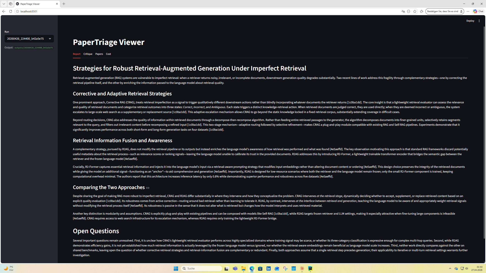
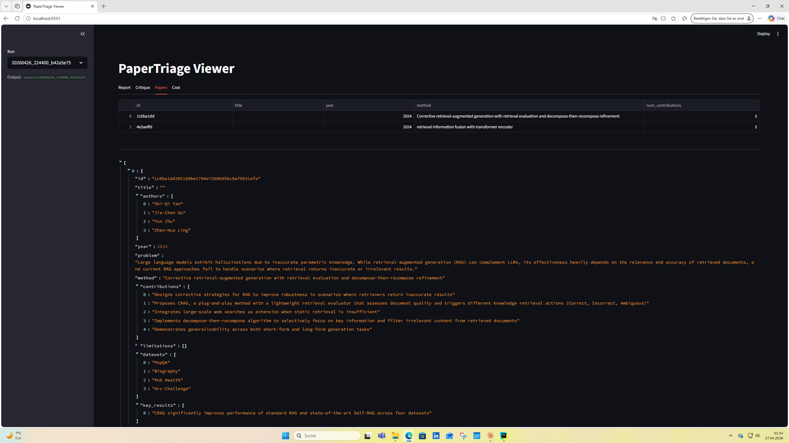
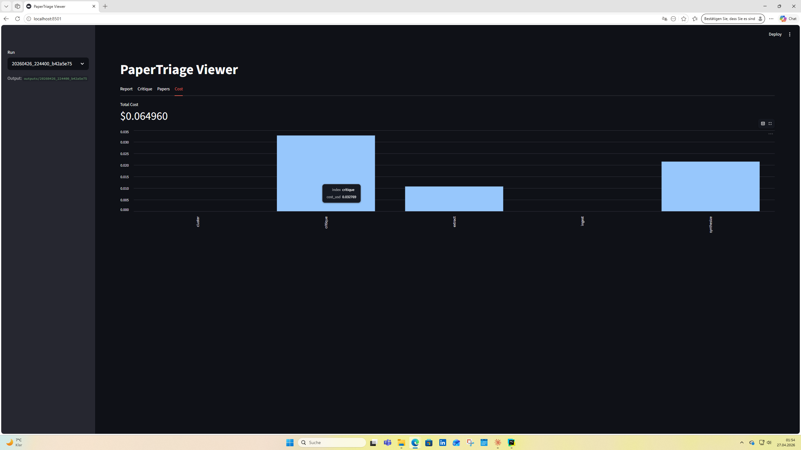

# Example Run: CRAG vs R²AG

A real pipeline run captured for demonstration. Skip the install and see what the
tool actually produces.

## Viewer screenshots

The Streamlit viewer renders this run as four tabs:

| Tab | Screenshot |
|---|---|
| Report |  |
| Critique |  |
| Papers |  |
| Cost |  |

## Setup

- 2 arXiv PDFs (see [`arxiv_papers.txt`](arxiv_papers.txt) for IDs and URLs — download them yourself for reproducibility)
- Question: *"What strategies do these papers propose to make retrieval-augmented generation more robust to imperfect retrieval, and how do their approaches differ?"*
- Models: Haiku for extraction, Sonnet for synthesis and critique

## Results

| Metric | Value |
|---|---|
| Total cost | $0.0651 |
| Pipeline duration | ~70s |
| Citations parsed from synthesis | 13 |
| Critique findings | 7 (2 medium, 5 low severity) |

## Files

- [`papers.json`](crag_vs_r2ag/papers.json) — extracted metadata (Haiku tool use)
- [`clusters.json`](crag_vs_r2ag/clusters.json) — TF-IDF clustering result (1 cluster, since <4 papers)
- [`report.md`](crag_vs_r2ag/report.md) — synthesised literature comparison (Sonnet)
- [`critique.md`](crag_vs_r2ag/critique.md) — LLM-as-judge findings, formatted
- [`critique.json`](crag_vs_r2ag/critique.json) — same findings as structured data
- [`cost.json`](crag_vs_r2ag/cost.json) — per-stage cost breakdown

## Notable observations

The synthesis subtly flattened CRAG's three-state retrieval logic (Correct / Incorrect / Ambiguous) into a binary, treating Incorrect and Ambiguous identically. The critique pass caught this as a Medium-severity finding and proposed a concrete reword.

The synthesis added speculative details about R²AG's retrieval metadata ("relevance scores or ranking signals") that were not explicitly stated in the source paper. The critique pass caught this as a separate Medium finding.

The critique also flagged editorial framing — describing R²AG's robustness as "passive" — as a Low-severity issue, since it introduces an unsupported value judgment between the two approaches.

This is the LLM-as-judge pattern working as designed: the synthesis stage produced fluent but subtly inaccurate prose; the critique stage caught both factual and editorial issues with calibrated severity and actionable fixes.
